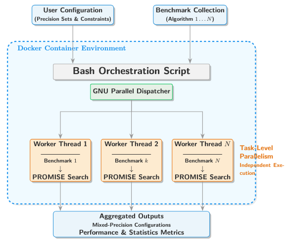

# HPC-MIX benchmarks

## Setup

To properly use the benchmark tool, one would need to install ``cadnaPromise`` in advance. To install, use:
```bash
pip install cadnaPromise
```
see [cadnaPromise](cadnaPromise/) in detail. 

To add the code for benchmarking, add a project folder inside directory ``mp_tests`` including data aa well as executable code, and properly configured file ``promise.yml`` as well as floating point type format ``fp.json``. 


To set up experiment results and plots, go to the `run_settings` folder and customize the files `run_setting_{k}.py`. You can place multiple `run_setting_*.py` files in this folder, and all of them will be used during execution.

Once ready, copy the folder `mp_tests` to `my_tests` and select the benchmark tests you want to run.
Then, navigate to the `my_tests` directory and run the script:
```bash
bash sync_settings.sh
```
This will broadcast all configuration files from `../run_settings/` to each benchmark subfolder inside `my_tests`.

The script `sync_settings.sh` automates the synchronization of experiment configuration files across multiple benchmark folders.

Usage:

```bash
bash sync_settings.sh [options]
```

Options:

- --delete, -d
  Delete existing files in each benchmark subfolder:
    - run_setting_*.py
    - run_debug_*.sh
    - fp.json

- --broadcast, -b
  Copy files from `../run_settings/` to each benchmark subfolder:
    - run_setting_*.py
    - run_debug_*.sh
    - fp.json


## Docker Build & Run

Ensure docker is installed and running. To deploy our benchmark tools in docker, one would consider:

- macOS (Apple Silicon) and Windows on ARM:
  Build and run with --platform linux/amd64.

To avoid cpmpilation pronlem of -m64 / ARM, build with

```bash
docker buildx build --platform linux/amd64 -t hpc-mix-cadna .
```

To run:
```bash
docker run --platform linux/amd64 -it --rm hpc-mix-cadna
```


- Windows (Intel/AMD) and Linux (x86_64):
  Build and run normally (no platform flag required).

To build
```bash
docker build -t hpc-mix-cadna .
```

To run
```bash
docker run -it --rm hpc-mix-cadna
```


After that, one would need to activate the ``cadnaPromise`` in their terminal:
```bash
activate-promise
```

## Benchmark Run

To run the mixed-precision benchmarks by PROMISE, one need to go to the folder ``mp_tests``, and use the command:

```bash
cd mp_tests
```



A **Bash automation script** to run `run_setting_1.py` to `run_setting_4.py` exisit across multiple experiment folders, with support for:

- Running **experiments** (marked executable code, `promise.yml`, `fp.json`)
- **Plotting** results
- Selective execution of **specific folders**

---

We stored the numerical algorithm to be benchmarked in setA, setB, ...., and more. The folder structure: 


```text
projects/
├── setA/                           <- Each set contains a test for a single benchmark
│   ├── run_setting_1.py            <- Customized setting for tests
│   ├── ......
│   ├── run_setting_k.py            <- Customized setting for tests
│   ├── C/C++ source code           <- Code to be examined   
│   ├── fp.json                     <- Floating point formats to be searched, defined by users or left as default
│   └── promise.yml                 <- Compilation setting for the C/C++ code defined by users
├── setB/
│   └── (same files as above)
├── run_benchmarks.sh               <- main benchmark script

```

> **Each valid benchmark folder to be exmined must at least contain**:
> - `run_setting_{i}.py`
> - `promise.yml`
> -  C/C++ source code

---

1. Make it executable:

chmod +x run_benchmarks.sh


2. Run the script from your project root:

./run_benchmarks.sh <run_exp> <run_plot> <run_debug> [folders...] [--parallel] [--jobs N]


Arguments:
- <run_exp>   : run experiments (1 / true / y = yes, 0 / false / n = no)
- <run_plot>  : run plotting (uses saved results if experiments are skipped)
- <run_debug> : run debug scripts (run_debug_*.sh matched to run_setting_*.py)

Optional:
- [folders...] : specify target benchmark folders (default: auto-detect all valid folders)
- --parallel   : enable parallel execution (setting-level parallelism)
- --jobs N     : number of parallel workers (default: $JOBS or nproc or 4)


Examples:

./run_benchmarks.sh 1 1 0
# Run experiments + plotting (no debug), sequentially on all folders

./run_benchmarks.sh 1 0 0
# Run experiments only

./run_benchmarks.sh 0 1 0
# Run plotting only

./run_benchmarks.sh 1 1 1
# Run experiments + plotting + debug

./run_benchmarks.sh 1 1 0 setA setB
# Run only on selected folders

./run_benchmarks.sh 1 1 0 --parallel --jobs 4
# Parallel execution with 4 workers

After runnning, in each benchmark directory, there will be corresponding prec_setting_1.json that generated by PROMISE as well as corresponding visualized plots.

In the end, one can quickly check their visualization in the plots folder via:

```bash
cd mp_tests
bash organize_plots.sh
```

### Generate Summary

After running all experiments, one can enenerate the number of floating point types for each precision settings:

```bash
python json_counts_sum.py

```


### ⚙️ Customization & Advanced Features

| 🧩 **Feature** | ✏️ **How to Modify** |
|:----------------|:--------------------|
| **Search Depth** | 🔍 Change `find . -maxdepth 2` → `-maxdepth 3` for deeper search, or remove `-maxdepth` for unlimited depth. |
| **Python Path** | 🐍 Replace `python3` with `python` or a specific interpreter path, e.g. `/path/to/venv/bin/python`. |
| **Add Logging** | 🧾 Redirect all output: `./run_plots.sh ... &> log.txt` (saves stdout and stderr). |
| **Parallel Runs** | ⚡ Install GNU Parallel: `sudo apt install parallel`. Then replace the loop with:  <br>```bash<br>export RUN_EXPERIMENTS RUN_PLOTTING<br>parallel -j4 run_folder ::: "${TARGET_FOLDERS[@]}"<br>``` |
| **More Files** | ➕ Add entries to the `missing=()` loop, e.g. `other_file.txt`. |

> 💡 **Tip:** Combine multiple tweaks for more flexible automation (e.g., deeper search + parallel execution).


### 🧭 Usage Guide

| 🖥️ **Command** | 📘 **Description** |
|:----------------|:------------------|
| `./run_benchmarks.sh` | 🧪 Run **experiments + plots** (no debug), **sequential**, all folders *(default)* |
| `./run_benchmarks.sh 1 0` | ⚙️ Run **only experiments** |
| `./run_benchmarks.sh 0 1` | 📊 Run **only plots** (uses saved data) |
| `./run_benchmarks.sh 1 1 1` | 🐞 Run **experiments + plots + debug scripts** |
| `./run_benchmarks.sh 1 1 setA setB` | 🎯 Sequential on selected folders |
| `./run_benchmarks.sh n y setA` | 📊 Plot only in `setA` *(short form)* |
| `./run_benchmarks.sh 0 1 --parallel` | ⚡ Parallel (setting-level) plots |
| `./run_benchmarks.sh 1 0 --parallel` | ⚡ Parallel experiments |
| `./run_benchmarks.sh 1 1 --parallel` | ⚡ Parallel experiments + plots |
| `./run_benchmarks.sh 1 1 setA setB --parallel` | 🔀 Parallel on selected folders |
| `./run_benchmarks.sh 1 1 --parallel --jobs 4` | ⚡ Parallel with 4 workers |


> 💡 **Tip:**  
> - Usage:  
>   `./run_benchmarks.sh <run_exp> <run_plot> <run_debug> [folders...] [--parallel] [--jobs N]`  
> - Boolean arguments accept:  
>   `1 / 0`, `true / false`, `yes / no` (case-insensitive)  
> - If no folders are specified, all valid benchmark folders are automatically discovered.  
> - `--parallel` enables task-level parallelism; `--jobs N` controls the number of workers.  


## License


This project is licensed under the **MIT License** – see the [LICENSE](LICENSE) file for details.
